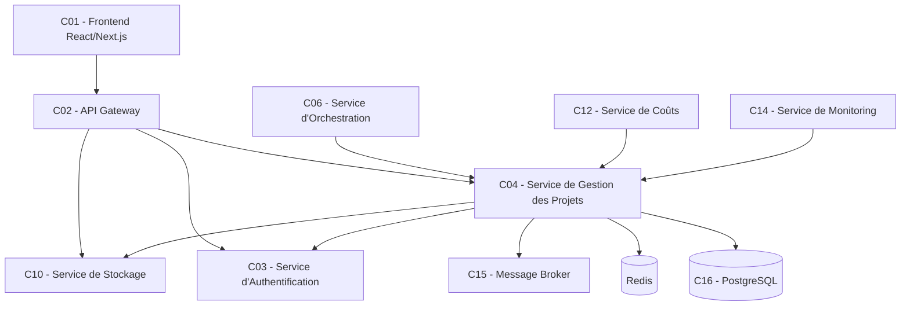
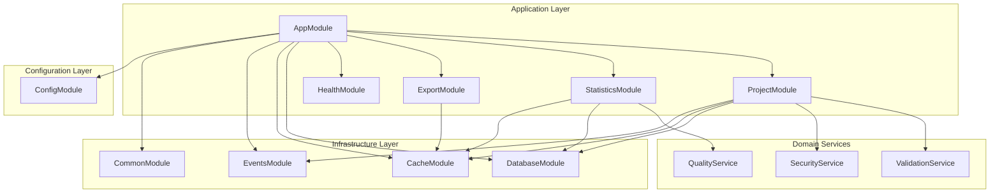

# Architecture du Service de Gestion des Projets (C04) - Version Complète

## Vue d'ensemble

Le Service de Gestion des Projets (C04) est un microservice NestJS sophistiqué conçu selon une architecture modulaire et orientée domaine. Il constitue le cœur métier de la plateforme Coders, orchestrant le cycle de vie complet des projets utilisateurs avec des fonctionnalités avancées de validation, sécurité et observabilité.

### Position dans l'écosystème Coders



### Responsabilités principales

**Responsabilités primaires :**
- Gestion CRUD des projets utilisateurs avec validation métier complète
- Orchestration des workflows de génération documentaire
- Collecte, validation et exposition des statistiques enrichies
- Export multi-format avec conversion PDF avancée
- Gestion fine des rôles et permissions utilisateur

**Responsabilités secondaires :**
- Cache intelligent multi-niveau pour optimiser les performances
- Audit trail complet avec traçabilité sécurisée
- Intégration événementielle avec les services tiers
- Validation et sanitisation automatique des données
- Scoring de qualité des données statistiques

**Limites architecturales :**
- Ne génère pas de contenu IA directement
- Ne gère pas l'authentification (délégué au C03)
- Ne stocke pas les fichiers physiquement (délégué au C10)
- Ne traite pas les paiements (délégué au C11)

---

## Architecture modulaire NestJS

### Diagramme de modules enrichi



### Structure des modules détaillée

#### ProjectModule - Module principal enrichi
```typescript
// Responsabilités étendues :
// - CRUD avec validation métier complète
// - Gestion des transitions d'état sécurisées
// - Orchestration avec services IA
// - Audit trail automatique
// - Sanitisation des données utilisateur

ProjectModule
├── Controllers/
│   └── ProjectController        // Endpoints REST avec validation avancée
├── Services/
│   ├── ProjectService          // Logique métier avec règles de validation
│   └── ProjectValidationService // Service de validation spécialisé
├── Repositories/
│   └── ProjectRepository       // Accès données avec cache intelligent
├── DTOs/
│   ├── CreateProjectDto        // Validation avec class-validator
│   ├── UpdateProjectDto        // Validation partielle sécurisée
│   ├── ProjectResponseDto      // Exposition avec transformation
│   └── ProjectListDto          // Format optimisé pour les listes
├── Entities/
│   └── ProjectEntity           // Modèle riche avec méthodes métier
└── Guards/
    └── ProjectOwnerGuard       // Protection accès par propriété
```

#### StatisticsModule - Gestion des métriques avancées
```typescript
// Responsabilités étendues :
// - Réception avec validation de cohérence
// - Calcul automatique de métriques dérivées
// - Scoring de qualité des données
// - Détection automatique d'anomalies
// - Historisation et tendances

StatisticsModule
├── Controllers/
│   └── StatisticsController     // API interne/externe avec authentification
├── Services/
│   ├── StatisticsService       // Logique d'agrégation avancée
│   └── QualityService          // Service de scoring qualité
├── Repositories/
│   └── StatisticsRepository    // Accès données JSON optimisé
├── DTOs/
│   ├── UpdateStatisticsDto     // Validation structure JSON
│   └── StatisticsResponseDto   // Exposition enrichie avec métadonnées
└── Entities/
    └── ProjectStatisticsEntity // Modèle avec validation automatique
```

#### CommonModule - Code partagé sécurisé
```typescript
// Responsabilités étendues :
// - Guards avec validation multi-niveau
// - Décorateurs avec injection sécurisée
// - DTOs avec transformation automatique
// - Utilitaires de validation robustes
// - Gestion d'erreurs métier

CommonModule
├── Guards/
│   ├── AuthGuard              // Validation JWT avec cache
│   └── ProjectOwnerGuard      // Vérification propriété optimisée
├── Decorators/
│   ├── CurrentUserDecorator   // Injection utilisateur sécurisée
│   └── AuthDecorator          // Composition auth avec rôles
├── DTOs/
│   └── PaginationDto          // Pagination avec validation limites
├── Interfaces/
│   ├── User                   // Interface utilisateur étendue
│   └── PaginatedResult        // Pagination offset/cursor
├── Enums/
│   └── ProjectStatus          // Enum avec métadonnées complètes
├── Exceptions/
│   ├── ProjectNotFoundException
│   └── UnauthorizedAccessException
└── Utils/
    └── ValidationUtils        // Utilitaires validation sécurisée
```

---

## Modèle de données enrichi

### Schéma Prisma principal

```prisma
// Modèle central enrichi
model Project {
  id                String             @id @default(uuid())
  name              String             // Nom avec validation stricte
  description       String?            // Description avec support Markdown
  initialPrompt     String             // Prompt avec sanitisation
  status            ProjectStatus      @default(ACTIVE)
  uploadedFileIds   String[]           // Références fichiers avec validation UUID
  generatedFileIds  String[]           // Références fichiers générés
  ownerId           String             // Propriétaire avec isolation stricte
  createdAt         DateTime           @default(now())
  updatedAt         DateTime           @updatedAt
  
  // Relation enrichie avec statistiques
  statistics        ProjectStatistics?
  
  @@map("projects")
  @@index([ownerId, status])          // Index composite optimisé
  @@index([createdAt])
  @@index([status, updatedAt])         // Index pour filtres avancés
}

// Modèle des statistiques enrichi
model ProjectStatistics {
  id               String   @id @default(uuid())
  projectId        String   @unique
  project          Project  @relation(fields: [projectId], references: [id], onDelete: Cascade)
  costs            Json     @default("{}")     // Coûts structurés avec breakdown
  performance      Json     @default("{}")     // Métriques avec bottlenecks
  usage            Json     @default("{}")     // Usage avec patterns d'activité
  metadata         Json     @default("{}")     // Métadonnées qualité
  lastUpdated      DateTime @updatedAt
  
  @@map("project_statistics")
  @@index([lastUpdated])               // Index pour queries temporelles
}

// États enrichis avec métadonnées
enum ProjectStatus {
  ACTIVE           // Projet actif avec toutes permissions
  ARCHIVED         // Archivé (récupérable) avec restrictions
  DELETED          // Supprimé (soft delete) avec audit
}
```

### Interfaces utilisateur étendues

```typescript
// Interface utilisateur de base
interface User {
  id: string;                    // UUID unique
  email: string;                 // Email validé
  roles: string[];               // Rôles avec permissions granulaires
}

// Interface utilisateur étendue
interface ExtendedUser extends User {
  name?: string;                 // Nom d'affichage
  avatar?: string;               // URL avatar
  createdAt?: Date;              // Date création compte
  lastLoginAt?: Date;            // Dernière connexion
  preferences?: UserPreferences; // Préférences personnalisées
  status?: UserStatus;           // Statut compte
  emailVerified?: boolean;       // Statut vérification email
}

// Préférences utilisateur
interface UserPreferences {
  language?: string;             // Langue (ISO 639-1)
  timezone?: string;             // Fuseau (IANA timezone)
  theme?: 'light' | 'dark';      // Thème interface
  notifications?: boolean;       // Notifications email
  dateFormat?: string;           // Format de date
  itemsPerPage?: number;         // Pagination préférée
}

// Énumération des rôles
enum UserRole {
  USER = 'user',                 // Utilisateur standard
  ADMIN = 'admin',               // Administrateur
  PREMIUM = 'premium',           // Utilisateur premium
}
```

### Structure des statistiques détaillée

```typescript
// Interface des coûts détaillés
interface CostsData {
  claudeApi?: number;            // Coûts API Claude
  storage?: number;              // Coûts stockage
  compute?: number;              // Coûts calcul
  bandwidth?: number;            // Coûts bande passante
  total?: number;                // Total calculé automatiquement
  currency?: string;             // Devise (ISO 4217)
  breakdown?: {                  // Répartition en pourcentages
    claudeApiPercentage: number;
    storagePercentage: number;
    computePercentage: number;
    bandwidthPercentage: number;
  };
  trend?: 'increasing' | 'decreasing' | 'stable';
}

// Interface des performances détaillées
interface PerformanceData {
  generationTime?: number;       // Temps génération (secondes)
  processingTime?: number;       // Temps traitement
  interviewTime?: number;        // Durée interview
  exportTime?: number;           // Temps export
  totalTime?: number;            // Temps total calculé
  queueWaitTime?: number;        // Temps attente queue
  efficiency?: {
    documentsPerHour?: number;   // Productivité
    tokensPerSecond?: number;    // Débit tokens
    processingEfficiency?: number;
    resourceUtilization?: number;
  };
  bottlenecks?: string[];        // Goulots identifiés automatiquement
  benchmark?: 'faster' | 'average' | 'slower';
}

// Interface d'usage enrichie
interface UsageData {
  documentsGenerated?: number;   // Nombre documents
  filesProcessed?: number;       // Fichiers traités
  tokensUsed?: number;           // Tokens consommés
  apiCallsCount?: number;        // Appels API
  storageSize?: number;          // Taille stockage (bytes)
  exportCount?: number;          // Nombre exports
  activityPattern?: {
    peakUsageHour?: number;      // Heure pic d'usage
    usageFrequency?: 'daily' | 'weekly' | 'occasional';
    preferredFormats?: string[]; // Formats préférés
    averageSessionDuration?: number;
  };
  resourceIntensity?: 'light' | 'moderate' | 'intensive';
}

// Métadonnées de qualité
interface StatisticsMetadata {
  sources?: string[];            // Services sources
  version?: string;              // Version données
  confidence?: number;           // Niveau confiance (0-1)
  dataFreshness?: number;        // Fraîcheur (minutes)
  completeness?: number;         // Complétude (pourcentage)
  qualityScore?: number;         // Score qualité (0-100)
  missingFields?: string[];      // Champs manquants
  estimatedFields?: string[];    // Champs estimés
}
```

---

## Pagination avancée

### Support double : Offset et Cursor

```typescript
// Pagination offset traditionnelle
interface PaginatedResult<T> {
  data: T[];
  pagination: {
    page: number;                // Page courante (1-based)
    limit: number;               // Éléments par page
    totalPages: number;          // Total pages
    hasNext: boolean;            // Page suivante disponible
    hasPrevious: boolean;        // Page précédente disponible
    offset: number;              // Offset calculé
  };
  total: number;                 // Total éléments
}

// Pagination cursor haute performance
interface CursorPaginatedResult<T> {
  data: T[];
  pagination: {
    cursor: string | null;       // Curseur courant
    nextCursor: string | null;   // Curseur suivant
    previousCursor: string | null; // Curseur précédent
    hasNext: boolean;
    hasPrevious: boolean;
  };
}

// Fonctions utilitaires
function createPaginatedResult<T>(
  data: T[],
  page: number,
  limit: number,
  total: number,
  options?: PaginatedOptions
): PaginatedResult<T>;

function mapPaginatedResult<T, U>(
  result: PaginatedResult<T>,
  mapper: (item: T) => U
): PaginatedResult<U>;
```

---

## Gestion des états avancée

### Métadonnées des statuts

```typescript
// Métadonnées complètes par statut
interface ProjectStatusMetadata {
  status: ProjectStatus;
  label: string;                 // Label français
  description: string;           // Description détaillée
  color: string;                 // Code couleur hexadécimal
  allowedTransitions: ProjectStatus[]; // Transitions autorisées
}

// Définitions complètes
const PROJECT_STATUS_METADATA = {
  ACTIVE: {
    status: 'ACTIVE',
    label: 'Actif',
    description: 'Projet en cours d\'utilisation, accessible pour consultation et modification',
    color: '#10B981',           // Green-500
    allowedTransitions: ['ARCHIVED', 'DELETED'],
  },
  ARCHIVED: {
    status: 'ARCHIVED',
    label: 'Archivé',
    description: 'Projet archivé, consultation possible mais masqué par défaut',
    color: '#F59E0B',           // Amber-500
    allowedTransitions: ['ACTIVE', 'DELETED'],
  },
  DELETED: {
    status: 'DELETED',
    label: 'Supprimé',
    description: 'Projet supprimé (soft delete), inaccessible aux utilisateurs',
    color: '#EF4444',           // Red-500
    allowedTransitions: [],     // État final
  },
};

// Fonctions utilitaires
function isValidStatusTransition(from: ProjectStatus, to: ProjectStatus): boolean;
function getStatusMetadata(status: ProjectStatus): ProjectStatusMetadata;
function getAvailableTransitions(currentStatus: ProjectStatus): ProjectStatus[];
```

---

## Sécurité et validation

### Validation automatique

```typescript
// Validation avec class-validator
export class CreateProjectDto {
  @IsString()
  @IsNotEmpty()
  @Length(1, 100)
  @Matches(/^[^<>'";&|`${}\\]*$/)    // Anti-XSS
  @Transform(({ value }) => sanitizeName(value))
  name: string;
  
  @IsOptional()
  @IsString()
  @Length(0, 1000)
  @Transform(({ value }) => sanitizeDescription(value))
  description?: string;
  
  @IsString()
  @IsNotEmpty()
  @Length(10, 5000)
  @Transform(({ value }) => sanitizePrompt(value))
  initialPrompt: string;
  
  @IsOptional()
  @IsArray()
  @IsUUID(4, { each: true })
  @ArrayMaxSize(10)
  uploadedFileIds?: string[];
}
```

### Sanitisation automatique

```typescript
// Transformation et nettoyage
@Transform(({ value }) => {
  if (typeof value === 'string') {
    return value
      .replace(/[\u0000-\u001f\u007f-\u009f]/g, '') // Caractères de contrôle
      .replace(/\s+/g, ' ')                          // Espaces multiples
      .trim();                                       // Espaces début/fin
  }
  return value;
})
```

### Méthodes métier sécurisées

```typescript
// Méthodes de l'entité Project
class ProjectEntity {
  // Validation statique
  static validateName(name: string): boolean;
  static validatePrompt(prompt: string): boolean;
  static validateFileIds(fileIds: string[]): boolean;
  
  // Gestion des fichiers
  addGeneratedFile(fileId: string): void;
  removeGeneratedFile(fileId: string): boolean;
  setGeneratedFiles(fileIds: string[]): void;
  
  // Transitions d'état
  archive(): void;                // ACTIVE → ARCHIVED
  restore(): void;                // ARCHIVED → ACTIVE  
  softDelete(): void;             // ANY → DELETED
  canTransitionTo(newStatus: ProjectStatus): boolean;
  
  // Méthodes utilitaires
  getComplexityEstimate(): 'low' | 'medium' | 'high';
  getActivityLevel(): 'new' | 'active' | 'mature' | 'inactive';
  belongsToUser(user: User): boolean;
  toLogSafeString(): string;      // Version sécurisée pour logs
}
```

---

## Qualité des données

### Scoring automatique

```typescript
// Calcul de qualité des statistiques
class ProjectStatisticsEntity {
  calculateDataQualityScore(): number {
    let score = 100;
    
    // Vérification complétude
    if (!this.costs.total) score -= 20;
    if (!this.performance.totalTime) score -= 20;
    if (!this.usage.documentsGenerated) score -= 15;
    
    // Validation cohérence
    const consistency = this.validateConsistency();
    if (!consistency.valid) {
      score -= consistency.issues.length * 5;
    }
    
    // Fraîcheur des données
    if (this.metadata?.dataFreshness > 60) {
      score -= Math.min(20, this.metadata.dataFreshness / 60 * 5);
    }
    
    return Math.max(0, score);
  }
  
  validateConsistency(): { valid: boolean; issues: string[] };
  identifyBottlenecks(): void;
  mergeCosts(newCosts: Partial<CostsData>): void;
  mergePerformance(newPerformance: Partial<PerformanceData>): void;
}
```

---

## Évolution et maintenance

### Extensibilité de l'architecture

**Ajout de nouveaux modules :**
```typescript
// Pattern pour nouveaux domaines
@Module({
  imports: [DatabaseModule, CacheModule, EventsModule, CommonModule],
  providers: [NewDomainService, NewDomainRepository],
  controllers: [NewDomainController],
  exports: [NewDomainService],
})
export class NewDomainModule {}
```

**Extension du modèle de données :**
```prisma
// Évolution sans breaking change
model Project {
  // Champs existants...
  
  // Nouveaux champs optionnels
  category        String?
  tags            String[]
  metadata        Json?
  priority        Priority?     @default(NORMAL)
  
  // Nouvelles relations
  collaborators   ProjectCollaborator[]
  attachments     ProjectAttachment[]
}
```

### Migration et compatibilité

**Versioning d'API :**
```typescript
// Support de multiples versions
@Controller({ version: '1', path: 'projects' })
export class ProjectV1Controller {}

@Controller({ version: '2', path: 'projects' })  
export class ProjectV2Controller {}
```

**Migrations de données :**
```typescript
// Scripts de migration avec validation
async function migrateProjectCategories() {
  const projects = await prisma.project.findMany();
  
  for (const project of projects) {
    const category = inferCategoryFromPrompt(project.initialPrompt);
    await prisma.project.update({
      where: { id: project.id },
      data: { category },
    });
  }
}
```

Cette architecture modulaire et évolutive permet au Service de Gestion des Projets de s'adapter aux besoins croissants de la plateforme Coders tout en maintenant une base de code maintenable, sécurisée et performante.